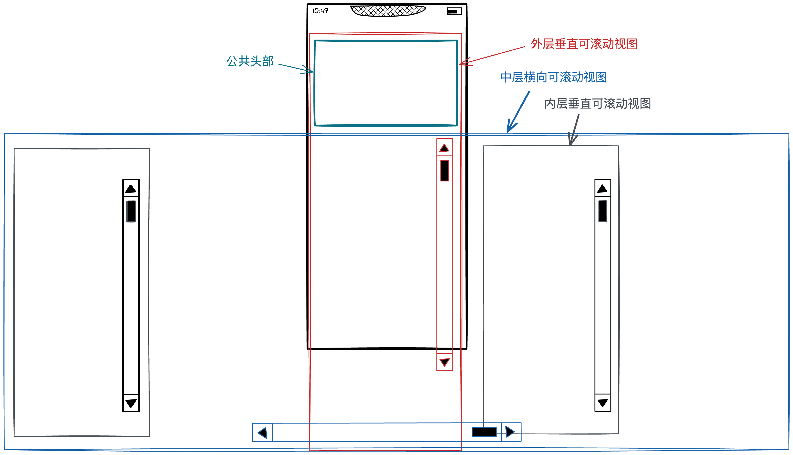
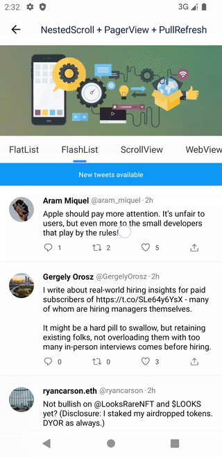
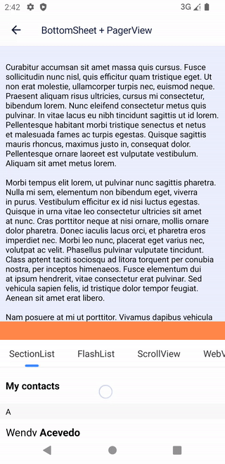
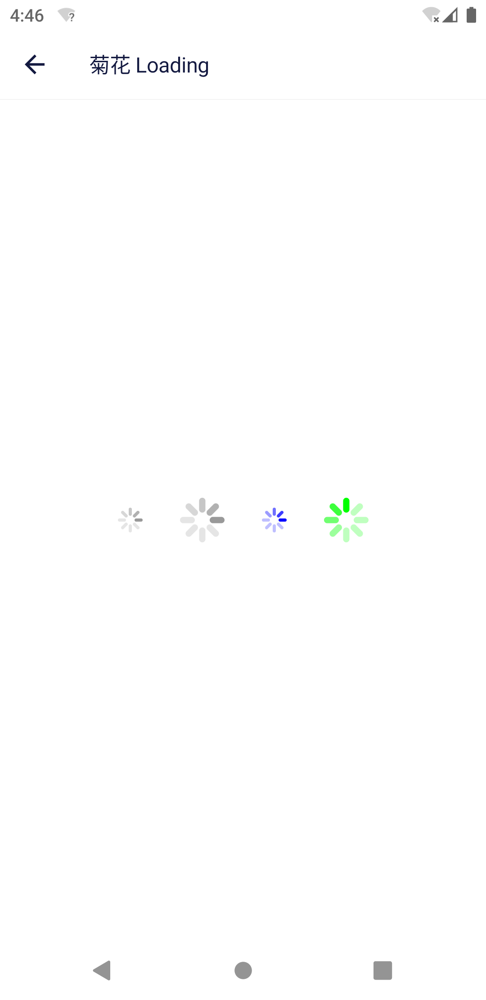

# React Native 原生 UI 组件

本仓库包含一系列原生组件：

### [NestedScrollView](./packages/nested-scroll/README.md)

用于实现嵌套滚动，使用简单。可以和 PagerView，TabView 等组合使用。

### [PullToRefresh](./packages/pull-to-refresh/README.md)

提供了在 React 层自定义下拉刷新的能力。

### [BottomSheet](./packages/bottom-sheet/README.md)

将 Android 的 [BottomSheetBehavior](https://developer.android.com/reference/com/google/android/material/bottomsheet/BottomSheetBehavior) 迁移到了 React Native 中，在 API 设计上也尽量和 Android 保持一致，同时支持 iOS。

### [ActivityIndicator](./packages/activity-indicator/README.md)

在 Android 上实现了和 iOS 类似的菊花组件。

### [ImageCropView](./packages/image-crop/README.md)

用来实现头像裁剪，和社区其它方安不同，仅仅只是个 View，非常方便页面的自定义布局。

也可以用来实现图片裁剪，支持设置裁剪区域。

### [KeyboardInsetsView](./packages/keyboard-insets/README.md)

KeyboardInsetsView 是一个 React Native 原生 UI 组件，用于处理软键盘遮挡输入框的问题。自动模式下使用非常简单，不需要额外代码来处理键盘。

如果想要实现类似聊天界面那样的效果，也不在话下。

### [Overlay](./packages/overlay/README.md)

`Overlay` 是一个 React Native 原生 UI 基础设施，它漂浮在你的 React Native 应用之上，可用于实现 Modal, Alert, Toast, Popover, Notification, Hoverball 等顶层 UI。
