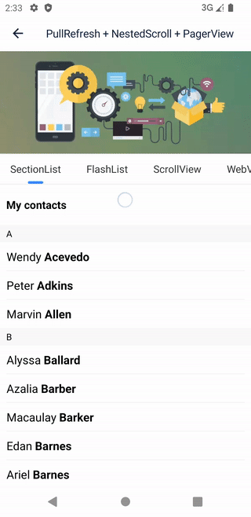

# PullToRefresh

`PullToRefresh` 是一个 React Native 原生 UI 组件。

React Native 内置的下拉刷新组件比较简陋，且 iOS 和 Android 平台的表现很不一致。幸运的是，它提供了一个 `refreshControl` 属性，可以用来自定义下拉刷新组件。

`PullToRefresh` 提供了自定义下拉刷新的能力。

## 特点

- 支持自定义下拉刷新
- 支持全局设置下拉刷新的样式
- 额外支持 `WebView`、`ScrollView`、[NestedScrollView](https://github.com/sdcxtech/react-native-troika/blob/master/packages/nested-scroll/README.md)
- 支持上拉加载更多

|                                                     |                                                  |
| --------------------------------------------------- | ------------------------------------------------ |
|  |  |

## Installation

```bash
yarn add @sdcx/pull-to-refresh
# &
pod install
```

## Usage

```tsx
import { PullToRefresh } from '@sdcx/pull-to-refresh'

function App() {
  const [refreshing, setRefreshing] = useState(false)

  return (
    <PullToRefresh
      refreshing={refreshing}
      onRefresh={() => {
        setRefreshing(true)
        setTimeout(() => {
          setRefreshing(false)
        }, 2000)
      }}>
      <FlatList
        nestedScrollEnabled
        data={Array.from({ length: 20 })}
        renderItem={({ item, index }) => <Text>{index}</Text>}
        keyExtractor={(item, index) => index.toString()}
      />
    </PullToRefresh>
  )
}
```

或者

```tsx
import { RefreshControl } from '@sdcx/pull-to-refresh'

function App() {
  const [refreshing, setRefreshing] = useState(false)

  return (
    <FlatList
      nestedScrollEnabled
      refreshControl={
        <RefreshControl
          refreshing={refreshing}
          onRefresh={() => {
            setRefreshing(true)
            setTimeout(() => {
              setRefreshing(false)
            }, 2000)
          }}
        />
      }
      data={Array.from({ length: 20 })}
      renderItem={({ item, index }) => <Text>{index}</Text>}
      keyExtractor={(item, index) => index.toString()}
    />
  )
}
```

> :exclamation: :exclamation: :exclamation:
> Android 是基于 [NestedScrolling API](https://developer.android.com/reference/androidx/core/view/NestedScrollingChild) 实现的。
>
> <h3>请记得为你的列表开启 `nestedScrollEnabled` 属性。</h3>
>
> :exclamation: :exclamation: :exclamation:

这两种使用方式在效果上并无不同。

此外，`PullToRefresh` 支持上拉加载更多，以及所有可滚动视图，譬如 `WebView`, `ScrollView`, `NestedScrollView`。

### 自定义下拉刷新

你一定不会想使用本库提供的默认下拉刷新，因为它太丑了。那么如何自定义下拉刷新呢？

首先，自定义一个 `PullToRefreshHeader`，你需要合理使用 `onStateChanged` 和 `onOffsetChanged` 这两个回调来实现你想要的下拉刷新效果。

记得将 `props` 中的 `onRefresh` 和 `refreshing` 这两个属性透传给 `PullToRefreshHeader`。

```tsx
import {
  PullToRefreshHeader,
  PullToRefreshHeaderProps,
  PullToRefreshOffsetChangedEvent,
  PullToRefreshStateChangedEvent,
  PullToRefreshState,
  PullToRefreshStateIdle,
  PullToRefreshStateRefreshing,
} from '@sdcx/pull-to-refresh'

export function CustomPullToRefreshHeader(props: PullToRefreshHeaderProps) {
  const { onRefresh, refreshing } = props

  const [text, setText] = useState('下拉刷新')

  const onStateChanged = useCallback((event: PullToRefreshStateChangedEvent) => {
    const state = event.nativeEvent.state
    if (state === PullToRefreshStateIdle) {
      setText('下拉刷新')
    } else if (state === PullToRefreshStateRefreshing) {
      setText('正在刷新...')
    } else {
      setText('松开刷新')
    }
  }, [])

  const onOffsetChanged = useCallback((event: PullToRefreshOffsetChangedEvent) => {
    console.log('refresh header offset', event.nativeEvent.offset)
  }, [])

  return (
    <PullToRefreshHeader
      style={styles.container}
      onOffsetChanged={onOffsetChanged}
      onStateChanged={onStateChanged}
      onRefresh={onRefresh}
      refreshing={refreshing}>
      <Text style={styles.text}>{text}</Text>
    </PullToRefreshHeader>
  )
}
```

### 设置全局默认下拉刷新样式

然后在应用启动时，设置全局默认下拉刷新。通常在你应用的入口文件处设置。

```tsx
import { PullToRefresh } from '@sdcx/pull-to-refresh'

PullToRefresh.setDefaultHeader(CustomPullToRefreshHeader)
```

该设置同时对 `PullToRefresh` 和 `RefreshControl` 生效。

### 设置局部特定下拉刷新样式

如果你的某些页面不想使用全局默认的下拉刷新样式，那么你可以设置 `PullToRefresh` 的 `header` 属性。此时，将 `onRefresh` 和 `refreshing` 属性传递给 `header`。

```tsx
import { PullToRefresh } from '@sdcx/pull-to-refresh'

function App() {
  const [refreshing, setRefreshing] = useState(false)

  return (
    <PullToRefresh
      header={
        <LocalPullToRefreshHeader
          refreshing={refreshing}
          onRefresh={() => {
            setRefreshing(true)
            setTimeout(() => {
              setRefreshing(false)
            }, 2000)
          }}
        />
      }>
      <FlatList
        nestedScrollEnabled
        data={Array.from({ length: 20 })}
        renderItem={({ item, index }) => <Text>{index}</Text>}
        keyExtractor={(item, index) => index.toString()}
      />
    </PullToRefresh>
  )
}
```

### 自定义 `RefreshControl`

当然，如果你不喜欢包裹 `PullToRefresh`，也可以自定义 `RefreshControl`

```tsx
import { RefreshControlProps } from 'react-native'
import { PullToRefresh } from '@sdcx/pull-to-refresh'

export function LocalRefreshControl(props: RefreshControlProps) {
  if (Platform.OS === 'android') {
    return <PullToRefresh header={<LocalPullToRefreshHeader {...props} />} />
  }
  return <LocalPullToRefreshHeader {...props} />
}
```

然后使用自定义的 `LocalRefreshControl` 即可：

```tsx
function App() {
  const [refreshing, setRefreshing] = useState(false)

  return (
    <FlatList
      nestedScrollEnabled
      refreshControl={
        <LocalRefreshControl
          refreshing={refreshing}
          onRefresh={() => {
            setRefreshing(true)
            setTimeout(() => {
              setRefreshing(false)
            }, 2000)
          }}
        />
      }
      data={Array.from({ length: 20 })}
      renderItem={({ item, index }) => <Text>{index}</Text>}
      keyExtractor={(item, index) => index.toString()}
    />
  )
}
```

### 上拉加载更多

加载更多有两种方式，一种方式是列表自身提供的**触底加载**更多，通过 `onEndReached` 属性实现。另一种方式是经典的**上拉加载**更多，通过 `PullToRefresh` 提供的 `onLoadMore` 属性实现。

大多数情况下，使用 `onEndReached` 或许是较好的选择。

如果你的 App 更倾向于上拉加载更多，那么你可以使用 `PullToRefresh` 的 `onLoadMore` 属性。

上拉加载有两种模式，一种是手动模式，像下拉刷新那样，释放后加载更多；另一种是自动模式，上拉一定距离后自动加载更多。

你需要根据 App 的设计偏好来选择合适的模式。

```tsx
import { PullToRefresh } from '@sdcx/pull-to-refresh'

function App() {
  const [loadingMore, setLoadingMore] = useState(false)
  const [noMoreData, setNoMoreData] = useState(false)

  const loadMore = () => {
    setLoadingMore(true)
    setTimeout(() => {
      setLoadingMore(false)
    }, 2000)
  }

  return (
    <PullToRefresh loadingMore={loadingMore} onLoadMore={loadMore} noMoreData={noMoreData}>
      <FlatList
        nestedScrollEnabled
        data={Array.from({ length: 20 })}
        renderItem={({ item, index }) => <Text>{index}</Text>}
        keyExtractor={(item, index) => index.toString()}
      />
    </PullToRefresh>
  )
}
```

### 自定义上拉加载更多

自定义加载更多和自定义下拉刷新差不多，自定义一个组合组件，将 `PullToRefreshFooter` 包裹在里面，并透传相关属性即可，如下：

```tsx
import {
  PullToRefreshFooter,
  PullToRefreshFooterProps,
  PullToRefreshStateChangedEvent,
  PullToRefreshStateIdle,
  PullToRefreshStateRefreshing,
} from '@sdcx/pull-to-refresh'

export function CustomPullToRefreshFooter(props: PullToRefreshFooterProps) {
  const { onRefresh, refreshing, noMoreData } = props

  const [text, setText] = useState('上拉加载更多')

  const onStateChanged = useCallback((event: PullToRefreshStateChangedEvent) => {
    const state = event.nativeEvent.state
    if (state === PullToRefreshStateIdle) {
      setText('上拉加载更多')
    } else if (state === PullToRefreshStateRefreshing) {
      setText('正在加载更多...')
    } else {
      setText('松开加载更多')
    }
  }, [])

  const onOffsetChanged = useCallback((event: PullToRefreshOffsetChangedEvent) => {
    console.log('refresh footer offset', event.nativeEvent.offset)
  }, [])

  return (
    <PullToRefreshFooter
      style={styles.container}
      manual={true /* 设置模式为手动 */}
      onOffsetChanged={onOffsetChanged}
      onStateChanged={onStateChanged}
      onRefresh={onRefresh}
      refreshing={refreshing}
      noMoreData={noMoreData}>
      <Text style={styles.text}>{noMoreData ? '没有更多数据了' : text}</Text>
    </PullToRefreshFooter>
  )
}
```

然后在应用启动时，设置全局默认上拉加载更多。通常在你应用的入口文件处设置。

```tsx
import { PullToRefresh } from '@sdcx/pull-to-refresh'

PullToRefresh.setDefaultFooter(CustomPullToRefreshFooter)
```

当然，也可以通过 `PullToRefresh` 的 `footer` 属性来为特定页面设置特定的上拉加载更多样式。

```tsx
import { PullToRefresh } from '@sdcx/pull-to-refresh'

function App() {
  const [loadingMore, setLoadingMore] = useState(false)

  return (
    <PullToRefresh
      footer={
        <LocalPullToRefreshFooter
          loadingMore={loadingMore}
          onLoadMore={() => {
            setLoadingMore(true)
            setTimeout(() => {
              setLoadingMore(false)
            }, 2000)
          }}
        />
      }>
      <FlatList
        nestedScrollEnabled
        data={Array.from({ length: 20 })}
        renderItem={({ item, index }) => <Text>{index}</Text>}
        keyExtractor={(item, index) => index.toString()}
      />
    </PullToRefresh>
  )
}
```

### 自定义 `RefreshControl` 来实现加载更多

如果你钟爱 `refreshControl`, 那么也可以定义一个 `LoadMoreRefreshControl`

```tsx
import { RefreshControlProps } from 'react-native'
import { PullToRefresh } from '@sdcx/pull-to-refresh'

export function LoadMoreRefreshControl(props: RefreshControlProps) {
  if (Platform.OS === 'android') {
    return <PullToRefresh footer={<CustomPullToRefreshFooter {...props} />} />
  }
  return <CustomPullToRefreshFooter {...props} />
}
```

然后使用自定义的 `LoadMoreRefreshControl` 即可：

```tsx
function App() {
  const [loadingMore, setLoadingMore] = useState(false)

  return (
    <FlatList
      nestedScrollEnabled
      refreshControl={
        <LoadMoreRefreshControl
          refreshing={loadingMore}
          onRefresh={() => {
            setLoadingMore(true)
            setTimeout(() => {
              setLoadingMore(false)
            }, 2000)
          }}
        />
      }
      data={Array.from({ length: 20 })}
      renderItem={({ item, index }) => <Text>{index}</Text>}
      keyExtractor={(item, index) => index.toString()}
    />
  )
}
```

嘿嘿，下拉刷新秒变上拉加载更多。
